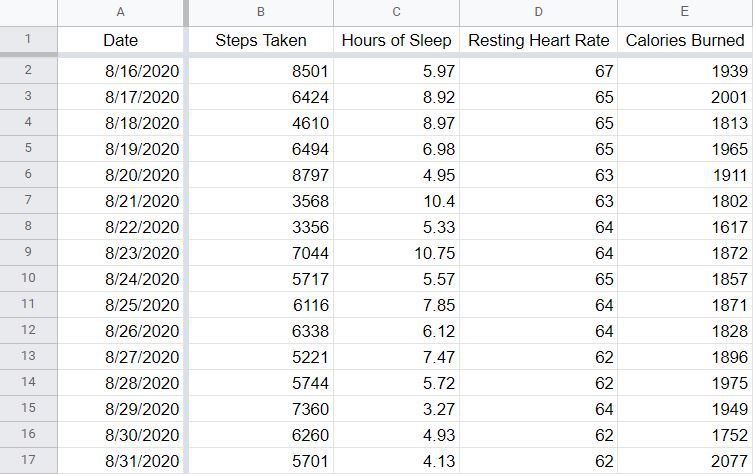
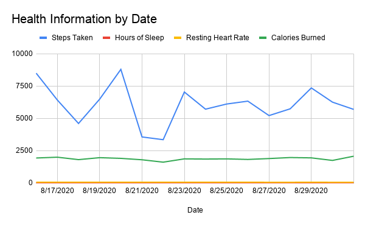
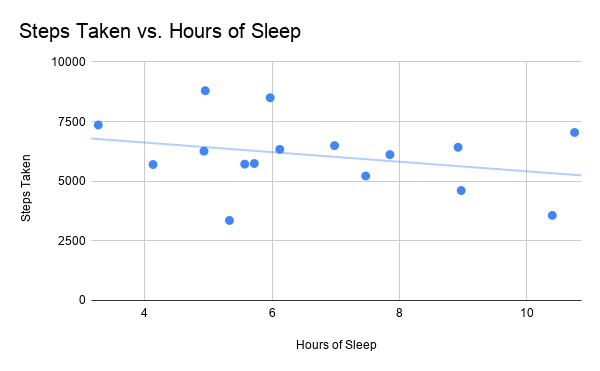

# Fitbit Data Visualization
## About
Fitbit Data Visualization is a program that extracts data from the Fitbit API into Google Spreadsheets to create user-friendly, visually appealing charts. Now your stats can be easily shared with anyone you know!

Python is used to automate the data extraction from the Fitbit Web API. The result of this automation process are 4 CSV files with health information (steps taken, hours of sleep, resting heart rate, and calories burned) in chronological order by date. The Google Apps Script API utilizes javascript, is used to organize this data into Google Spreadsheets (See image 1), and creates a line chart (See image 2) and scatter plot (See image 3). Click [here](https://docs.google.com/spreadsheets/d/1KHqDeSCkyEEZRY4ujwnaGFXOLODLa7unNC2K9v3vZEs/edit?usp=sharing) to see this information in Google Spreadsheets.

Image 1: Health Data

Image 2: Line chart

Image 3: Scatter Plot

## Built With
### Languages
- Python
- Javascript

### APIs
- Google Apps Script
- Fitbit Web

## MVP (Minimum Viable Product) Goal
- Manually get (access/refresh token)
- Fetch data from Fitbit API
- Extract data to CSV files
- Import CSV files to Google Drive
- Run Google Apps Script to organize CSV file data into already created Google Spreadsheet
- Create graph visualization of the data from Google Spreadsheet

## To Do
- [x] Add labels to the cumulative chart's legend
- [ ] Merge the health information in 4 separate CSV files produced into 1 CSV file
- [ ] Add error checking for dates with missing stats (aka dates on which the fitbit was not worn or the data has not been uploaded)
- [ ] Add permissions functionality: The script can access the user's list of emails to share with in a Google doc or spreadsheet, instead of manually sharing to each email
- [ ] Add customizations for a user to input their own Fitbit user id and the time period they want to see a data visualization of
- [ ] Automate new CSV files to be imported to a user's google drive
- [ ] Automate Google Apps Script to run when a new CSV file is found or updated

# Contributors
- [Kenneth Nguyen](https://github.com/KennethNguyen) - Creator
- [Jennie Nguyen](https://github.com/jennie-n) - Creator